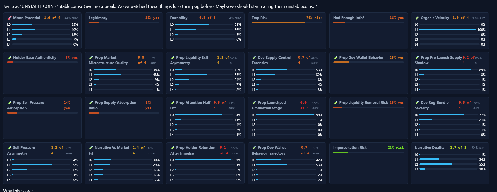

# Fairlaunch Tracker

A real-time monitoring dashboard for fair-launch token activity across major launch ecosystems.

Fairlaunch Tracker watches live token creation and market activity across Solana, BNB Chain, and Robinhood Chain, then scores and ranks launches based on liquidity, holder structure, dev reputation, momentum, and a range of market-quality heuristics.

The project is designed to help identify promising new launches early while filtering out noisy or suspicious activity.

## Overview

This app continuously listens to launch events from supported chains and platforms, enriches them with market data, and presents the best opportunities in a live dashboard.

It is designed for:

- monitoring new fair launches as they appear
- noticing high-probability opportunities early
- reviewing token quality and risk signals
- tracking market momentum and launch health over time
- alerting on strong setups through optional Telegram integrations

## Supported launch ecosystems

Current supported coverage includes:

- Solana
  - Pump.fun
  - StonkFun
  - Ember
- BNB Chain
  - Four.meme
  - Flap.sh
- Robinhood Chain
  - Pons
  - Long.xyz (when configured)

## Features

- live fair-launch detection from real blockchain feeds and public APIs
- market-data enrichment for market cap, volume, liquidity, and holders
- scoring heuristics for candidate launch quality and opportunity strength
- dev reputation and launch-risk analysis
- dashboard UI for tracking active, graduated, and rugged tokens
- configurable environment-driven tuning
- optional Telegram notifications for high-scoring opportunities
- optional TypeSafe AI System One (Jev) integration for qualitative signal evaluation
- Docker deployment support
- persistent data directory for snapshots and state

## TypeSafe AI System One (Jev)

Fairlaunch Tracker includes an optional integration with TypeSafe's AI System One, referred to in the codebase as `Jev`.

This system is used to evaluate qualitative dimensions that deterministic on-chain metrics alone cannot fully assess, such as:

- narrative quality
- legitimacy and impersonation risk
- durability and sustainability
- trap/rug risk
- moon potential and comparative pick quality

In practice, Jev is used as a second-stage reasoning layer after a token has already cleared basic quantitative filters. It can add or subtract confidence as part of the opportunity score, and it can help judge whether a token looks like a coherent launch or a coordinated trap.

The integration is optional. If `TYPESAFE_API_KEY` is blank or disabled, the tracker continues to run using the deterministic scoring model without Jev evaluation.

### Jev configuration

The `.env.example` file includes settings such as:

- `TYPESAFE_API_KEY`
- `TYPESAFE_API_BASE`
- `TYPESAFE_MODEL`
- `JEV_MIN_SCORE_TO_EVALUATE`
- `JEV_MAX_CALLS_PER_DAY`
- `JEV_MAX_CALLS_TOTAL`
- `JEV_WEIGHT_*` tuning values

These controls allow the project to balance AI-based evaluations with cost, confidence, and output quality constraints.

## Jev dashboard example

The system evaluates a token across a matrix of qualitative dimensions and scores them with explanatory confidence. This is a representative snapshot of the TypeSafe AI System One (Jev) reasoning layer used in the app:



## Project structure

```text
.
├── .env.example             # Example environment and RPC configuration
├── .gitignore
├── Dockerfile               # Container build definition
├── docker-compose.yml       # Docker Compose deployment config
├── requirements.txt         # Python dependencies
├── tracker.py               # Main tracker logic and API server
├── static/
│   └── dashboard.html       # Web dashboard frontend
├── image.png                # Jev dashboard example image
├── exports/
│   └── snapshot-2026-09-17.json
└── README.md
```

## Requirements

- Python 3.11+
- pip
- WebSocket-capable RPC endpoints for the chains you enable
- Optional API keys for Telegram and external intelligence providers

## Installation

Clone the repository:

```bash
git clone https://github.com/xjp2/fairlaunch-tracker.git
cd fairlaunch-tracker
```

Create your environment file:

```bash
cp .env.example .env
```

Edit `.env` to set your RPC URLs and enable any services you want to use. The example file includes a large set of optional and required configuration variables for chains, scoring rules, Telegram alerts, and AI-assisted evaluation.

Install dependencies:

```bash
python -m venv .venv
source .venv/bin/activate
pip install -r requirements.txt
```

Start the app:

```bash
python tracker.py
```

By default, the dashboard is served on:

```text
http://localhost:8000
```

## Docker

This project includes Docker support for containerized deployment.

```bash
cp .env.example .env
docker compose up --build -d
```

The provided container exposes port `8000` and stores persistent state in `/app/data`.

## Configuration

Most runtime settings are configured through environment variables in `.env`.

Key configuration areas include:

- chain RPC/WebSocket endpoints
- contract addresses and event signatures
- market-data API endpoints
- scoring and filtering thresholds
- Telegram notification settings
- optional TypeSafe AI System One (Jev) evaluation settings

The app is designed to start with safe defaults for many values and only requires specific endpoints when you want full coverage for a chain or system.

## Dashboard

The dashboard is bundled in `static/dashboard.html` and provides a compact terminal-style overview of tracked tokens and opportunities.

It displays information such as:

- active launch activity
- market cap, volume, and liquidity signals
- dev reputation and holder quality
- token status (WATCHING, GRADUATED, RUGGED, etc.)
- scoring and risk metrics

## Health check

The Docker image includes a health check against:

```text
/api/health
```

## Notes

This project is focused on live monitoring and opportunity detection for fast-moving launch environments. It is best used with properly configured RPC/WebSocket endpoints and a real-time environment where you want continuous visibility into launch activity.

The TypeSafe AI System One (Jev) layer is intended to improve judgment quality by evaluating qualitative risk and opportunity signals beyond simple numerical thresholds, but it remains optional and cost-aware.

## License

No explicit repository license is currently declared in the project metadata.

## Future improvements

This project is designed to be extended with additional launchpads, scoring systems, and alerting integrations. If you want to customize or grow the tracker, the most natural extension points are:

- new chain integrations
- additional launchpad decoders
- more market-data enrichment providers
- dashboard UX improvements
- alerting and notifications
- automated export/snapshot workflows
